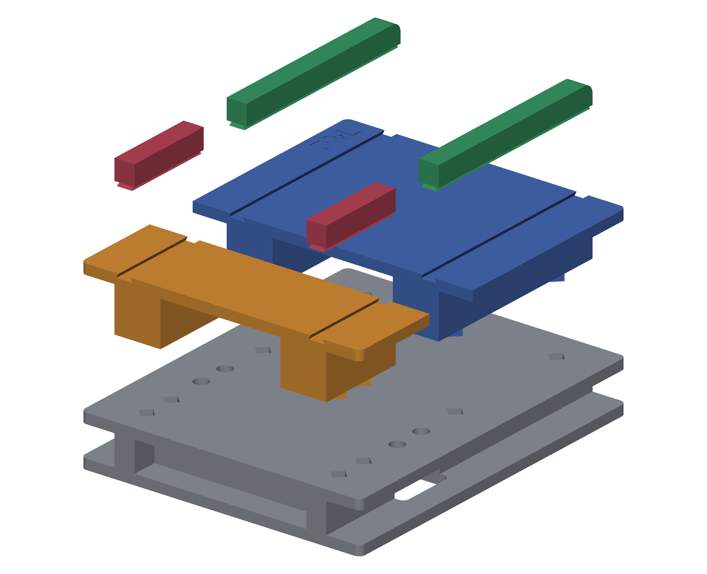

# Notice de montage

Aucune vis entre les pièces imprimées : tout tient par emboîtement. Les seuls
boulons du projet fixent le mécanisme métallique sur la base.

Toutes les cotes ci-dessous sont **mesurées sur les STL** de ce dépôt.

## Repères

Le repère du modèle est celui de l'assemblage :

- **X** = largeur, 0 à 140 mm ;
- **Y** = profondeur, de l'arrière (Y = 12,75) vers l'avant (Y = 185,75) ;
- **Z** = hauteur, dessous des pieds à −20, surface des plateaux à +32.

« Arrivée » désigne le grand plateau, celui où l'on pose le sandwich avant de
le pousser dans les rouleaux.

## 1. Le socle

`Fond_+_base.stl` se pose à plat. C'est un plateau de 5 mm d'épaisseur porté par
deux longerons, 25 mm de haut en tout.

Il porte trois choses :

- **huit logements en losange** (diagonale 8,28 mm, 5 mm de profondeur) dans la
  face supérieure — quatre pour chaque plateau ;
- **quatre trous Ø 7 mm** traversant le plateau, entraxes 98 mm en X et 15,5 mm
  en Y, dans la bande centrale. C'est là que se boulonne le mécanisme ;
- deux bossages sous ces trous, qui descendent jusqu'au bas du socle.

Les trous débouchent dans le volume creux sous le plateau : les écrous se posent
par-dessous, socle retourné, avant de remettre la presse sur ses pieds.

## 2. Le mécanisme

Les deux plateaux ménagent entre eux **une bande libre de 28 mm** (Y = 57,75 à
85,75) sur toute la largeur. Le bâti métallique des rouleaux prend place là,
boulonné sur les quatre trous.

Le poser **avant** les plateaux : une fois ceux-ci emboîtés, les têtes de vis ne
sont plus accessibles.

À vérifier avant de serrer : la ligne de pincement des rouleaux doit tomber
**au niveau de la surface des plateaux**, à Z = 32. Le sandwich entre à plat,
sans marche.

## 3. Les deux plateaux

`Zone_arrivee.stl` (grand, 100 mm de profondeur) à l'avant, `Zone_arriere.stl`
(petit, 45 mm) à l'arrière.

Chacun descend sur quatre **ergots en losange** (diagonale 8,00 mm, 4 mm de
longueur) qui tombent dans les logements du socle. Le jeu est de **0,1 mm par
face** : l'emboîtement est ferme, il se fait à la main mais ne flotte pas.
Si une pièce force, ébavurer l'ergot plutôt que d'élargir le logement.

Une fois en place, les deux plateaux présentent **la même surface à Z = 32** de
part et d'autre du mécanisme.

## 4. Les rails

Quatre pièces, montées en dernier : `Guide_gauche` et `Guide_droit` sur le grand
plateau, `Reglette_arriere_gauche` et `..._droite` sur le petit.

Elles ne se posent pas par le dessus. Leur pied est une **queue d'aronde**
(6,8 mm de large en haut, 7,6 mm en bas, flancs à 26,57°) qui **se glisse par le
bout de la rainure**, dans le sens de la longueur du plateau. La rainure fait
2 mm de profondeur ; le jeu est là encore de 0,1 mm par face.

Poussées à fond, les quatre pièces s'alignent sur deux axes — X = 17 à 27 et
X = 113 à 123 — et forment de chaque côté **un rail continu interrompu par la
bande du mécanisme**. Le rail dépasse de 10 mm au-dessus de la surface du
plateau.

C'est l'entrefer de ces deux rails, 86 mm, qui fixe la largeur du sandwich.

## Démontage

Dans l'ordre inverse : rails hors des rainures par coulissement, plateaux
soulevés à la verticale, mécanisme déboulonné. Rien n'est collé.
