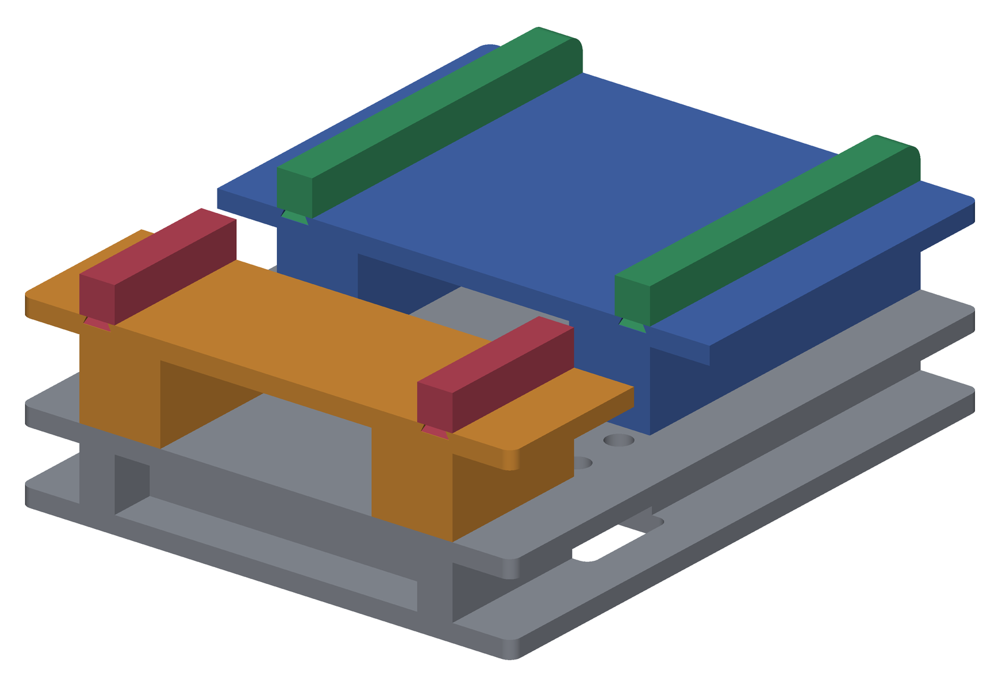

# Presse CuttleBug Remix

Une base imprimée en 3D qui remonte le **mécanisme à rouleaux d'une presse
Provo Craft Cuttlebug / Cuttlekids** sur un plan de travail utilisable :
deux plateaux à la même hauteur de part et d'autre des rouleaux, et des rails
de guidage qui tiennent le sandwich aligné pendant le passage.

Le mécanisme métallique (rouleaux, engrenages, manivelle) est récupéré sur une
machine d'occasion. Tout le reste — plateaux, base, rails — est imprimé.

## Contenu

- `stl/` — les sept pièces, telles qu'exportées d'OnShape le 17/09/2026
- [`MONTAGE.md`](MONTAGE.md) — la notice de montage
- `images/` — vues d'assemblage

## Les pièces

Cotes et volumes **mesurés sur les STL** (volume plein, pas la consommation
de filament réelle).

| Fichier | Rôle | Encombrement | Volume |
|---|---|---|---|
| `Fond_+_base.stl` | socle, reçoit le mécanisme | 140 × 173 × 25 mm | 284,3 cm³ |
| `Zone_arrivee.stl` | grand plateau (entrée) | 140 × 100 × 31 mm | 168,8 cm³ |
| `Zone_arriere.stl` | petit plateau (sortie) | 140 × 45 × 31 mm | 76,3 cm³ |
| `Guide_gauche.stl` · `Guide_droit.stl` | rails du grand plateau | 10 × 100 × 11,9 mm | 11,2 cm³ pièce |
| `Reglette_arriere_gauche.stl` · `..._droite.stl` | rails du petit plateau | 10 × 45 × 11,9 mm | 5,1 cm³ pièce |

Volume total imprimé : **562 cm³**. Assemblé : **140 × 173 × 62 mm**.

## Ce qu'il faut en plus

- le **mécanisme à rouleaux** d'une Cuttlebug ou d'une Cuttlekids (les machines
  d'occasion se trouvent autour de 10 €) ;
- de quoi le boulonner : la base présente quatre trous **Ø 7 mm** traversant le
  plateau, entraxes **98 × 15,5 mm**.

## Impression

**PLA.** Les jeux d'assemblage du modèle ont été réglés sur coupons imprimés et
essayés à la main : **0,1 mm par face** sur les ergots comme sur les queues
d'aronde — c'est le serrage le plus fort des séries essayées, et celui qui tient
le mieux. Une imprimante qui sort plus gras que la mienne demandera un coup de
lime sur les ergots plutôt qu'une reprise du modèle.

Les STL sont exportés **en coordonnées d'assemblage** : dans le slicer, chaque
pièce arrive à sa place dans la presse, pas posée sur le plateau. Les reposer à
plat avant de trancher.

Aucun support n'est nécessaire si la base et les deux plateaux sont imprimés
**face de travail contre le plateau d'impression** — leur dessous est creux, les
pieds partent vers le haut. Les queues d'aronde ont des flancs à 26,57°, donc
autoportants.

> Cette orientation est déduite de la géométrie des fichiers, pas relevée d'un
> profil de slicer.

## Licence

Cette œuvre est mise à disposition sous licence
[Creative Commons BY-NC-SA 4.0](https://creativecommons.org/licenses/by-nc-sa/4.0/deed.fr).

« Cuttlebug », « Cuttlekids » et « Provo Craft » sont des marques de leurs
propriétaires respectifs. Ce projet n'est ni affilié ni approuvé par eux : c'est
un remontage d'un mécanisme acheté d'occasion.
